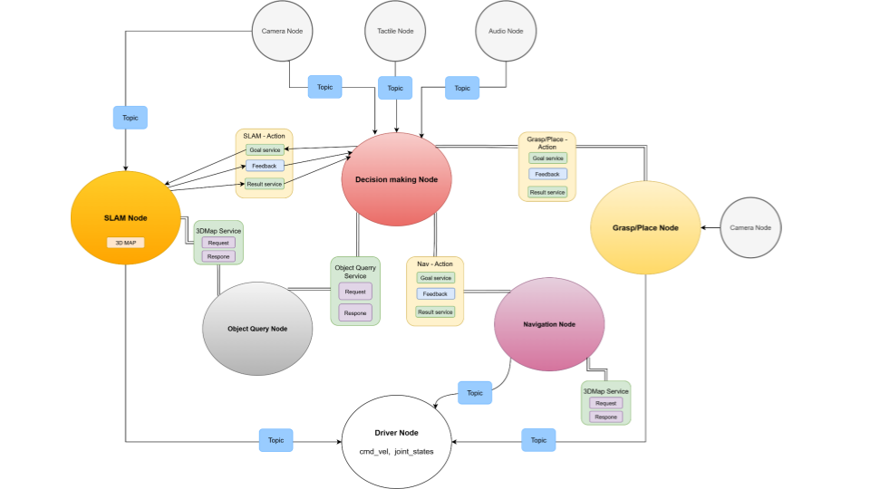

# Robotic System Workspace Description

<a id="table-of-contents"></a>

## Table of Contents

- [1. Executive Summary](#section-1-executive-summary)
- [2. Repository Structure](#section-2-repository-structure)
- [3. Environment and Dependency Configuration](#section-3-environment-and-dependency-configuration)
- [4. Package Descriptions](#section-4-package-by-package-technical-analysis)
- [4.1 `decision_maker`](#section-41-decision_maker)
- [4.2 `mm_interface`](#section-42-mm_interface)
- [4.3 `get_pose`](#section-43-get_pose)
- [4.4 `kachaka_interfaces`](#section-44-kachaka_interfaces)
- [4.5 `kachaka_laser_api`](#section-45-kachaka_laser_api)
- [4.6 `kachaka_nav`](#section-46-kachaka_nav)
- [4.7 `map_alignment`](#section-47-map_alignment)
- [4.8 `object_query`](#section-48-object_query)
- [4.9 `object_query_interfaces`](#section-49-object_query_interfaces)
- [5. Custom ROS Interfaces Summary](#section-5-custom-ros-interfaces-summary)
- [6. Runtime Data Assets and Alignment Utilities](#section-6-data-assets-and-utility-scripts)
- [6.1 `data/Util`](#section-61-datautil)
- [6.2 `data/lab`](#section-62-datalab)
- [6.3 `data/map_alignment`](#section-63-datamapalignment)
- [7. Runtime Interaction Between Packages](#section-7-runtime-interaction-between-packages)
- [8. Setup and Execution Guide](#section-8-practical-setup-and-execution-guide)
- [9. Visualization with RViz2](#section-9-visualization-with-rviz2)



<details>
<summary id="section-1-executive-summary"><strong>1. Executive Summary</strong></summary>

This repository is a ROS 2 workspace that integrates command interpretation, semantic object lookup, mobile navigation, map alignment, pose extraction, LiDAR acquisition, and a prototype semantic SLAM service. The workspace is organized around Python-based ROS 2 application packages and several interface packages that define custom actions and services. In addition to runtime code, the repository includes precomputed semantic map data, alignment assets, generated build outputs, and utility scripts for converting and validating map representations.

From a system perspective, the workspace implements a perception-to-action pipeline:

1. A user command is provided through text or audio.
2. The `decision_maker` package interprets the command into primitive robot actions.
3. The `object_query` package resolves semantic object names to coordinates from a semantic point-cloud map.
4. The `map_alignment` assets provide the transformation required to convert 3D semantic-map coordinates into the 2D navigation frame.
5. The `kachaka_nav` package plans and executes motion on either a real Kachaka robot or a simulation backend.
6. The `decision_maker` package optionally dispatches grasp/place actions through custom interfaces.
7. Supporting packages publish pose, LiDAR, and experimental semantic SLAM outputs.

The workspace therefore functions as a multi-package robotics application focused on semantic task execution in a mapped indoor environment.

</details>

<details>
<summary id="section-2-repository-structure"><strong>2. Repository Structure</strong></summary>

The repository root contains the container definition, the ROS 2 workspace, and a few supporting directories:

```text
robotic_system/
├── Dockerfile          # Development image definition
├── entrypoint.sh       # Container startup script
├── architecture.png    # System overview diagram
├── robot_ws/           # ROS 2 workspace
│   ├── src/            # ROS 2 source packages
│   ├── data/           # Semantic maps, alignment files, utilities, and lab assets
│   ├── build/          # Colcon build outputs
│   ├── install/        # Installed package outputs
│   ├── log/            # Historical colcon build logs
│   ├── environment.yml # Minimal Conda environment descriptor
│   ├── requirement.txt # Small curated Python package list used by Dockerfile
│   └── conda-lock.yml  # Conda lock metadata
├── kachaka-main/       # Vendored Kachaka API repository
└── temp/               # Temporary outputs and sample generated data
```

### 2.1 Source Packages

The `src/` directory contains the following ROS 2 packages:

| Package | Type | Purpose |
|---|---|---|
| `decision_maker` | `ament_python` | High-level task orchestration, command ingestion, and action dispatch |
| `decision_maker_interfaces` | `ament_cmake` | Alternate task action interface package retained for mock/test workflows |
| `get_pose` | `ament_python` | TF-to-`PoseStamped` conversion utility |
| `kachaka_interfaces` | `ament_cmake` | Custom navigation action definition |
| `kachaka_laser_api` | `ament_python` | LiDAR acquisition from the Kachaka API and scan conversion |
| `kachaka_nav` | `ament_python` | Navigation servers, drivers, map utilities, calibration tools, and visualization |
| `map_alignment` | `ament_python` | Offline and online map alignment between 3D semantic maps and 2D LiDAR maps |
| `mm_interface` | `ament_cmake` | Custom task, grasp, and place action definitions |
| `object_query` | `ament_python` | Semantic object lookup service over point-cloud map data |
| `object_query_interfaces` | `ament_cmake` | Object query service definition |
| `semantic_slam` | `ament_python` | Prototype semantic SLAM action server and client |
| `semantic_slam_interfaces` | `ament_cmake` | Semantic SLAM action definition |

### 2.2 Non-Source Directories

| Directory | Role |
|---|---|
| `build/` | Package-specific intermediate build outputs created by `colcon build` |
| `install/` | Generated runtime installation tree for ROS 2 packages |
| `log/` | Build and packaging logs from multiple historical `colcon` executions |
| `data/Util/` | Map conversion scripts, alignment YAML files, semantic metadata, and NPZ assets |
| `data/lab/` | Environment-specific lab maps, semantic point clouds, and map verification scripts |
| `kachaka-main/` | External Kachaka API code and tooling vendored into the repository |
| `temp/` | Temporary generated datasets and intermediate experiment outputs |

The `build/`, `install/`, and `log/` directories are generated artifacts rather than hand-maintained source code. They are still relevant because they confirm that the workspace has been built repeatedly and recently.

</details>

<details>
<summary id="section-3-environment-and-dependency-configuration"><strong>3. Environment and Dependency Configuration</strong></summary>

### 3.1 `requirement.txt`

`requirement.txt` is the shorter curated list used directly by the Docker build. It contains the higher-level Python libraries the image needs on top of ROS and system packages, such as:

- `numpy`
- `opencv-python`
- `torch` and `torchvision`
- `open3d`
- `ultralytics`
- `matplotlib`
- `pandas`
- `scikit-learn`
- `transforms3d`

This is the Python package list that matters for the current containerized runtime setup.

### 3.2 `environment.yml`

`environment.yml` defines a minimal Conda environment named `robot_ros`. The file is sparse and does not enumerate the full set of dependencies required by the workspace. In practice, `requirement.txt` and the package manifests are more informative than `environment.yml`.

### 3.3 Docker Environment Setup

The repository root already contains:

- `Dockerfile`
- `entrypoint.sh`
- `.dockerignore`

The Dockerfile:

- starts from `ros:humble-ros-base-jammy`
- installs ROS desktop tooling, RViz, rosbag, RealSense support, and build utilities
- builds `librealsense` from source
- installs Miniconda under `/opt/conda`
- creates the `robot_ros` Conda environment
- installs Python dependencies and Kachaka API support
- builds the ROS 2 workspace with `colcon`

The entrypoint script:

- sources `/opt/ros/humble/setup.bash`
- activates the `robot_ros` Conda environment
- rebuilds the workspace with `colcon build --symlink-install`
- sources `install/setup.bash`
- opens an interactive shell

For Jetson Thor development, the expected layout is:

- Docker Compose directory on the host: `~/robotic`
- repository root on the host: `~/robotic/robotic_system`
- ROS 2 workspace on the host: `~/robotic/robotic_system/robot_ws`
- running container name: `robotic_system`

#### 3.3.1 Build and Run the Development Container

```bash
cd ~/robotic
docker compose build
docker compose up -d
docker exec -it robotic_system bash
```

If you need to add or change Python packages, ROS packages, or system dependencies, modify `~/robotic/robotic_system/Dockerfile` and rebuild the container rather than performing ad hoc installs in a running shell.

</details>

<details>
<summary id="section-4-package-by-package-technical-analysis"><strong>4. Package Descriptions</strong></summary>

The detailed subsections below focus on the core packages used in the main semantic-navigation pipeline. Supporting interface or prototype packages such as `decision_maker_interfaces`, `semantic_slam`, and `semantic_slam_interfaces` are still part of the repository and are summarized in sections 2 and 5.

<a id="section-41-decision_maker"></a>

## 4.1 `decision_maker`

### Purpose

`decision_maker` is the orchestration layer that connects human command input, semantic lookup, coordinate conversion, navigation, and manipulation. In this repository it is the package that turns a short phrase such as `go to chair` or `bring bottle to table` into a concrete execution pipeline involving ROS topics, services, and actions.

### Main Files

| File | Role |
|---|---|
| `decision_maker/decision_maker_node.py` | Main execution node that plans command batches and dispatches navigation/manipulation requests |
| `decision_maker/decision_maker_test.py` | Experimental or test-oriented variant of the orchestration node |
| `decision_maker/text_command_node.py` | Reads terminal input and publishes text commands |
| `decision_maker/audio_command_node.py` | Records audio, runs speech-to-text, and publishes commands |
| `decision_maker/nl_command_node.py` | Terminal-based natural-language command frontend with live task-status feedback |
| `decision_maker/cancel_command_node.py` | Publishes cancellation requests |
| `decision_maker/mock_nav_server.py` | Mock navigation action server for testing |
| `decision_maker/mock_grasp_server.py` | Mock grasp/place action server for testing |
| `decision_maker/scenario_library.py` | Scenario templates that translate phrases into primitive execution steps |
| `decision_maker/nl_planner.py` | Lightweight world model used by scenarios to resolve objects and places |
| `decision_maker/command_types.py` | Command data abstraction |

### Core Behavior

At runtime, the package is organized as a three-stage chain:

1. A frontend node such as `nl_command_node.py` publishes a human sentence on `/manual_command`.
2. `decision_maker_node.py` matches the sentence against `SCENARIO_REGISTRY`, expands it into primitive steps, and stores the resulting batch in an internal queue.
3. The executor thread consumes those steps one by one and forwards them to `/object_query`, `/Navigate_to_pose`, and `/task_command`.

The package therefore separates:

- command intake
- symbolic scenario expansion
- world lookup
- frame conversion
- low-level action dispatch

That separation is important because it allows the planner logic in `scenario_library.py` and `nl_planner.py` to remain simple string-based code while `decision_maker_node.py` handles ROS integration, timeouts, visualization, and cancellation.

### `nl_command_node.py`

`nl_command_node.py` is the simplest user-facing entry point in the workspace. It implements a lightweight ROS 2 node named `nl_command_node` whose only job is to bridge terminal text input into the command pipeline.

Its implementation is intentionally minimal:

- it publishes `std_msgs/String` to `/manual_command`
- it subscribes to `/task_status`
- it creates a timer running every `0.1` seconds
- the timer uses `select.select()` on `sys.stdin` to perform non-blocking terminal polling

This design avoids a blocking `input()` call. Because stdin is polled inside a timer callback, the node can continue receiving and printing task feedback while the user is idle at the terminal.

Operationally, the file provides three behaviors:

- `send_command()` strips user text, publishes it, and logs the outgoing command
- `on_feedback()` classifies incoming status strings by prefix such as `done`, `failed`, and `cancel`
- `_poll_stdin()` checks whether a full terminal line is available and forwards it immediately

The node runs under a `MultiThreadedExecutor`, which is more than sufficient for this small workload and keeps the implementation consistent with the other multi-callback nodes in the repository. In the full system, this file is best understood as a console UI for the `decision_maker` package rather than as a planner or executor itself.

### `nl_planner.py`

`nl_planner.py` contains a small but important utility layer centered on the `WorldModel` class. It is not a full natural-language parser. Instead, it acts as the lookup and formatting helper used by scenario functions.

`WorldModel` is designed to be reused from an existing ROS node:

- if a node instance is passed into `WorldModel(node=self)`, it reuses that node's logger and ROS client context
- otherwise it creates a standalone node named `world_model_node`
- it always creates a client for `object_query_interfaces/ObjectQuery`

The file has two major responsibilities.

First, it resolves object names:

- `resolve_object(name)` normalizes the name to lowercase
- waits up to `3` seconds for `/object_query` to become available
- sends an asynchronous service request
- manually waits on the future with a timeout loop
- returns either `(x, y, z)` or `None`

This means all higher-level scenario code can treat semantic lookup as a normal Python function call.

Second, it resolves place names:

- `resolve_place(name)` first checks a hard-coded dictionary for symbolic places such as `me`, `home`, and `kitchen`
- if the place is not in the static table, it forwards the name to `resolve_object()`
- if that also fails, it falls back to `(0.0, 0.0, 0.0)` and logs a warning

That fallback is a notable design choice: scenario code calling `resolve_place()` will usually receive some coordinate tuple even for an unknown destination, which keeps execution moving but may also send the robot toward the origin if the label is unresolved.

The other key utility is `fmt_goto()`:

- it accepts either `(x, y)` or `(x, y, theta)`
- inserts a default heading of `0.0` when only two values are provided
- returns the normalized primitive string `goto:x,y,th`

This is the format expected by `decision_maker_node.py` during batch execution.

### `scenario_library.py`

`scenario_library.py` is the symbolic task-expansion layer. It does not talk to ROS directly. Instead, each function receives a `WorldModel` instance plus a command argument string and returns a `List[str]` of primitive actions.

Those primitives use a very small internal language:

- `goto:x,y,theta` for direct coordinate navigation
- `goto:name` for symbolic navigation that will be resolved later
- `grasp:item`
- `place:item:destination` for placing an item at a target location
- `handover:item` for handing an item to a person or receiver at the current target
- `place:destination` as a legacy/test shorthand still accepted by the executor

The main scenario functions are:

- `go_to_target(model, target)`: resolve a place or object and produce a single navigation step
- `give_item(model, item, dest="me")`: navigate to an object, grasp it, navigate to the destination, and hand it over
- `park_robot(model)`: return to `home`
- `clean_table(model)`: go to `table`, pick `trash`, and move it to `trash_bin` or `home`
- `fetch_drink(model)`: go from `fridge` to `me`
- `test_arm(model)`: emit a pure manipulation sequence for testing

The transfer command parser handles commands of the form:

- `bring bottle to table`
- `bring the bottle on cabinet to table`
- `bring apple from shelf to me`
- `place the bottle on table to chair`
- `handover the bottle on sofa to table`

Its parsing strategy is deliberately lightweight:

- normalize to lowercase
- remove a leading `from`
- split source and destination on `to` or `into`
- strip articles such as `the`, `a`, and `an`
- detect prepositions such as `on`, `in`, `at`, `near`, `inside`, `under`, and `next to`
- if a prepositional phrase exists in the source, navigate to the location phrase rather than directly to the object label

For example, `bring bottle on cabinet to table` becomes a primitive sequence conceptually equivalent to:

- navigate to `cabinet`
- grasp `bottle`
- navigate to `table`
- hand over `bottle`

The `place` and `handover` prefixes use the same source/destination parser, but choose different final manipulation primitives:

- `place the bottle on table to chair` becomes `goto:table`, `grasp:bottle`, `goto:chair`, `place:bottle:chair`
- `handover the bottle on sofa to table` becomes `goto:sofa`, `grasp:bottle`, `goto:table`, `handover:bottle`

The registry at the bottom of the file is the bridge into `decision_maker_node.py`:

- `SCENARIO_REGISTRY` maps fixed text prefixes such as `go to`, `bring`, `place`, `handover`, `give me`, and `go home` to Python functions
- `decision_maker_node.py` performs prefix matching against this registry
- once a key matches, the remaining text is passed as that scenario's argument string

This file is therefore the policy layer for command meaning, while `decision_maker_node.py` is the runtime layer for execution.

### `decision_maker_node.py`

`decision_maker_node.py` is the package's central runtime component. It is the file that actually binds together command topics, scenario expansion, object-query lookup, map-frame conversion, navigation actions, manipulation actions, queueing, visualization, and cancellation.

The node starts by constructing several long-lived subsystems:

- `self.cmd_queue`: a bounded queue storing parsed command batches
- `self.world = WorldModel(node=self)`: shared world model for scenario functions
- `self.map2d_params`: optional 3D-to-2D calibration loaded from `map3d_to_map2d_yaml`
- `self.visualizer`: optional OpenCV map viewer loaded from `map_yaml`
- `self.nav_client`: `ActionClient` for `kachaka_interfaces/Navigate` on `/Navigate_to_pose`
- `self.task_client`: `ActionClient` for `TaskCommand` on `/task_command`
- `self.obj_client`: service client for `/object_query`

The main parameters are:

- `map3d_to_map2d_yaml`: alignment result used to project semantic 3D points into the 2D navigation frame
- `map_yaml`: occupancy-map style YAML used by the built-in `MapVisualizer`
- `grasp_approach_dist`: distance threshold that allows navigation to stop early when the next step is a grasp

The file also contains an embedded helper class, `MapVisualizer`, which:

- loads a map image and YAML metadata
- converts world coordinates to map pixels
- keeps a thread-safe image buffer
- runs a dedicated GUI thread for `cv2.imshow()` and `cv2.waitKey()`
- draws labels and markers for queried objects and navigation targets

The decision maker imports `TaskCommand` from `mm_interface.action` to send manipulation requests to grasp and place server. The interface is provided by the grasp and place part.

The command-handling flow is as follows.

1. `on_text_event()` receives a `String` from `/manual_command`.
2. The function scans `SCENARIO_REGISTRY` for the first matching prefix.
3. A background planning thread runs the corresponding scenario function so that blocking object-query calls do not stall the ROS executor.
4. `enqueue_command()` stores the resulting primitive batch in `self.cmd_queue`.
5. `command_executor_loop()` continuously dequeues batches and forwards them to `_execute_batch()`.

`_execute_batch()` is the primitive dispatcher. It iterates over action strings and sends them to:

- `_execute_nav()` for `goto:...`
- `_execute_grasp()` for `grasp:...`
- `_execute_place()` for `place:...`
- `_execute_handover()` for `handover:...`

The navigation path inside `_execute_nav()` is the most important part of the file.

It supports two forms of `goto`:

- direct coordinates such as `goto:-0.27,1.76,0.00`
- symbolic labels such as `goto:chair`

For coordinate form, it:

- parses the payload
- treats the incoming tuple as a semantic-map coordinate
- applies the loaded 3D-to-2D transform
- optionally draws the transformed target on the OpenCV map
- sends the converted goal to the `Navigate` action server

For symbolic form, it:

- calls `_query_object_position()`
- waits for the semantic service response
- applies the same transform inside that helper
- returns a navigation-frame coordinate tuple

During action execution, `_execute_nav()` also monitors `distance_remaining` feedback from the navigation action. If the next primitive is a grasp and the robot gets within `grasp_approach_dist`, the node cancels the remaining navigation path early and immediately proceeds to the grasp step. That shortcut is what allows the system to stop close enough for manipulation instead of insisting on exact pose convergence.

Manipulation is intentionally simple: the executor converts internal primitives into text commands for the `mm_interface` `TaskCommand` server.

- `_execute_grasp()` waits `5` seconds, then converts `grasp:item` into a `TaskCommand` goal like `grasp the apple`
- `_execute_place()` converts `place:item:destination` into a `TaskCommand` goal like `place bottle to chair`
- `_execute_handover()` converts `handover:item` into a `TaskCommand` goal like `handover bottle`
- `_send_task_command()` handles goal sending, waiting, feedback logging, timeout, and success checking for manipulation operations

The file also contains explicit cancellation and cleanup behavior:

- `/cancel_command` is listened to by `on_cancel_event()`
- `_send_cancel()` publishes `cancel` on `/task_status`
- `destroy_node()` shuts down worker threads and stops the OpenCV visualizer cleanly

At the bottom of the file, `load_map3d_to_map2d()` and `map3d_point_to_map2d_xy()` implement the actual projection math. They load the `plane_fit` and `sim2` blocks from the alignment YAML, project a 3D semantic point onto the fitted plane basis, then apply a 2D similarity transform. This is the exact bridge between the perception map used by `object_query` and the 2D map used by `kachaka_nav`.

<a id="section-42-mm_interface"></a>

## 4.2 `mm_interface`

### Purpose

`mm_interface` is a ROS 2 interface-only package. Its role is to define the action contract that the decision-making layer can use when sending textual manipulation or task commands to another server.

### Interface Files

| File | Description |
|---|---|
| `action/TaskCommand.action` | Generic text task action |

### `TaskCommand.action`

The action definition is intentionally minimal:

- Goal: `string command`
- Result: `bool success`, `string message`
- Feedback: `string feedback`

This design makes the action suitable as a generic bridge between symbolic task planning and an external manipulation or behavior-execution module. The planner side does not need to know whether the downstream server is controlling a gripper, an arm, a handover behavior, or a scripted skill. It only needs to send a textual instruction and wait for structured success or failure.

<a id="section-43-get_pose"></a>

## 4.3 `get_pose`

### Purpose

`get_pose` is a small utility package that republishes a TF transform as a `PoseStamped` topic.

### Main File

| File | Role |
|---|---|
| `get_pose/tf_to_pose.py` | Looks up a TF transform and publishes it as `pose` |

### Behavior

`TfToPose`:

- reads `target_frame`, `base_frame`, and `rate_hz` parameters
- listens to TF using `Buffer` and `TransformListener`
- looks up the transform from `target_frame` to `base_frame`
- republishes the result on the `pose` topic as `geometry_msgs/PoseStamped`

This is a practical bridge utility for logging, debugging, rosbag processing, or downstream tooling that prefers pose messages over TF lookups.

<a id="section-44-kachaka_interfaces"></a>

## 4.4 `kachaka_interfaces`

### Purpose

This package defines the navigation action contract used throughout the workspace.

### Interface File

| File | Description |
|---|---|
| `action/Navigate.action` | Navigation goal with target coordinates, result status, and distance feedback |

The `Navigate` action is the primary motion interface used by `decision_maker` and implemented by navigation servers in `kachaka_nav`.

<a id="section-45-kachaka_laser_api"></a>

## 4.5 `kachaka_laser_api`

### Purpose

This package connects to the Kachaka robot API and republishes robot LiDAR data into ROS 2.

### Main Files

| File | Role |
|---|---|
| `kachaka_laser_api/kachaka_laser_from_api_node.py` | Retrieves LiDAR scans from the Kachaka API and publishes `LaserScan` |
| `kachaka_laser_api/scan2ptcloud.py` | Converts laser scans into point-cloud representations |

### Core Behavior

`kachaka_laser_from_api_node.py`:

- connects to a real Kachaka robot through `kachaka_api.KachakaApiClient`
- publishes `sensor_msgs/LaserScan`
- supports configurable topic name, frame override, publish rate, cursor-based deduplication, and reconnection policy
- runs with callback groups and a multi-threaded executor to separate timer and I/O behavior

<a id="section-46-kachaka_nav"></a>

## 4.6 `kachaka_nav`

### Purpose

`kachaka_nav` is the motion-execution package. It exposes the custom `Navigate` action, translates user-frame goals into the robot's native frame, talks to either the real Kachaka hardware or a simulator driver, and continuously republishes the robot pose and path for the rest of the system.

### Main Runtime Files

| File | Role |
|---|---|
| `kachaka_nav/modular_nav.py` | Main lightweight navigation action server used by the integrated pipeline |
| `kachaka_nav/robot_driver.py` | Driver abstraction for real Kachaka hardware and ROS simulation |

### Navigation Architecture

The package is built around two layers:

1. `Navigate.action` as the control contract seen by upstream packages.
2. `robot_driver.py` as the concrete backend for either real hardware or simulation.

`robot_driver.py` provides two interchangeable implementations:

- `KachakaRealDriver` for direct communication with the physical Kachaka platform
- `RosSimDriver` for simulation-oriented control through ROS topics

`modular_nav.py` is the runtime bridge between those drivers and the rest of the workspace.

### `modular_nav.py`

`modular_nav.py` implements `ModularNavNode`, a ROS 2 node that acts as a navigation action server and a pose-republishing bridge at the same time.

Its startup logic is structured around four concerns.

First, it declares configuration parameters:

- `use_sim`: select the simulator driver or the real robot driver
- `kachaka_ip`: network endpoint for the real robot
- `user_map_yaml`: optional YAML file whose `origin` field defines the offset and yaw between the user map and the Kachaka-native map
- `goal_xy_tolerance`: planar tolerance used to decide when a goal is considered reached, defaulting to `0.6` meters in the latest file

Second, it configures callback concurrency:

- a `MutuallyExclusiveCallbackGroup` is used for timer-driven pose publishing
- a `ReentrantCallbackGroup` is used for the `Navigate` action server
- the node runs under a `MultiThreadedExecutor`

This prevents the pose-publication loop and the action-execution loop from blocking each other.

Third, it creates the runtime publishers and TF output:

- `/user_pose` publishes the pose transformed into the user-defined map frame
- `/kachaka_pose` publishes the robot pose in the Kachaka-native `map` frame
- `/robot_path` appends the motion trajectory as a `nav_msgs/Path`
- a TF transform from `map` to `base_link` is broadcast continuously

Fourth, it selects the navigation backend:

- `RosSimDriver(self)` when `use_sim` is true
- `KachakaRealDriver(robot_ip)` otherwise

The frame-conversion logic is explicit and local to this file:

- `load_map_alignment()` reads the `origin` field from a YAML file
- `transform_user_to_kachaka()` rotates and translates a goal from the user map into the robot's native map
- `transform_kachaka_to_user()` performs the inverse conversion for published pose output

The periodic pose path in `publish_pose_callback()` does the following every `0.1` seconds:

- queries the current pose from the active driver
- converts yaw into a quaternion
- publishes a `PoseStamped` in the native `map` frame
- broadcasts the matching TF transform
- appends that pose to the path history, capped at `8000` samples
- converts the same pose into `user_map` coordinates and publishes it on `/user_pose`

The action server is implemented in `execute_callback()`. When a `Navigate` goal arrives:

- it interprets the request as a goal in the user frame
- converts it into native Kachaka coordinates
- calls `driver.move_native()` in non-blocking mode when possible
- repeatedly polls the robot pose
- computes Euclidean distance to the goal
- publishes `distance_remaining` feedback
- stops navigation successfully once the goal is within `goal_xy_tolerance`

The callback also contains explicit timeout and cancellation behavior:

- if execution exceeds `60` seconds, it tries `cancel_current_command()` and `stop()`
- when the goal is close enough, it also cancels/stops the robot's internal motion to avoid overshooting
- it returns a `Navigate.Result(success=...)` and marks the goal as succeeded or aborted accordingly

This node assumes upstream code already solved the semantic-navigation problem. `modular_nav.py` does not perform object lookup, semantic reasoning, or 3D-to-2D projection itself. It expects `decision_maker_node.py` to hand it a final 2D goal in the user map frame, then focuses purely on:

- frame conversion between user map and Kachaka map
- motion execution through the selected driver
- progress feedback through `distance_remaining`
- pose and path publication for monitoring

In the integrated system, this file is therefore the execution endpoint that receives 2D targets from `decision_maker_node.py` after semantic lookup and map alignment have already been completed.

<a id="section-47-map_alignment"></a>

## 4.7 `map_alignment`

### Purpose

`map_alignment` solves the calibration problem between a 3D semantic map and a 2D LiDAR or occupancy map. This is a critical subsystem because semantic object lookup is performed in a 3D reconstructed map, while robot navigation operates in a 2D motion-planning frame.

### Main Files

| File | Role |
|---|---|
| `map_alignment/map_alignment_v2.py` | Main offline-friendly alignment pipeline |
| `map_alignment/collect_data.py` | Data capture utility for synchronized sensor and pose collection |
| `map_alignment/lidar_camera_link_bridge.py` | TF bridge between lidar and camera frames |

### Core Capabilities

`map_alignment_v2.py` performs:

- loading of offline 2D and 3D pose sequences
- parsing of quaternion conventions and pose conventions
- optional camera-to-base transformation via extrinsic calibration
- timestamp normalization, scale compensation, and time-offset search
- nearest-neighbor trajectory synchronization
- RANSAC-based SE(2) estimation
- nonlinear refinement of translation, yaw, and optional scale
- estimation of z-offset between map frames
- generation of a static TF transform from `map_2d` to `map_3d`
- export of YAML results and a ready-to-run `static_transform_publisher` command script

This package is central to the semantic navigation workflow because the `decision_maker` package loads the alignment result from `data/Util/alignment.yaml` to transform semantic 3D object coordinates into 2D navigation targets.

### `collect_data.py`

This script is a substantial data-acquisition utility. It includes:

- TF pose capture
- RealSense image/depth handling
- file organization for output datasets
- synchronized sample export

It supports calibration dataset generation rather than online navigation directly.

<a id="section-48-object_query"></a>

## 4.8 `object_query`

### Purpose

`object_query` is the semantic-memory package of the workspace. It loads offline semantic-map assets, organizes them into a searchable in-memory database, serves object-location queries through ROS 2, and publishes visualization outputs that make those semantic results visible in RViz.

### Main Files

| File | Role |
|---|---|
| `object_query/object_query_server.py` | Main semantic object query server and map-visualization publisher |
| `object_query/object_query_client.py` | Simple service client |
| `object_query/object_query_test.py` | Expanded test or experimental server variant |

### Core Behavior

The package's central implementation is `object_query_server.py`.

### `object_query_server.py`

`object_query_server.py` defines `ObjectQueryServer`, a ROS 2 node that combines three responsibilities:

- loading semantic and geometric map data from disk
- answering semantic lookup requests through `/object_query`
- publishing RViz-friendly point clouds and markers

The file begins by declaring several map-related parameters:

- `3dmap_path`: dense 3D scene point cloud
- `map_path`: semantic NPZ map containing points and semantic IDs
- `semantic_path`: JSON metadata describing segment IDs and class names
- `instance_path`: optional instance-level JSON with centroids per object instance
- `auto_align`: optional flag to rotate the semantic map so floor-like classes align with the XY plane

At startup the node creates:

- a service server on `/object_query`
- a publisher on `/object_list`
- a `MarkerArray` publisher on `/semantic_map_markers`
- a `PointCloud2` publisher on `/map_pointcloud`

It also initializes an in-memory database:

- `self.object_db` is a `defaultdict(list)`
- each key is a lowercased semantic label such as `chair` or `bottle`
- each value is a list of 3D centroids

The loading path has two modes.

1. Preferred path: `load_instance_map()`

If `instance_path` exists, the server reads instance-level annotations from JSON:

- it expects an `instances` dictionary
- each instance contributes `semantic_name` and `centroid`
- centroids are grouped by semantic class name into `object_db`
- the dense 3D map is loaded separately for visualization

This mode gives the system direct object-instance centroids instead of deriving them from broad semantic segments.

2. Fallback path: `load_semantic_map()`

If no instance-level file exists, the server reconstructs the database from the semantic map itself:

- loads semantic points from either `pts` or `means3D`
- loads semantic IDs from either `pan` or `semantic_ids`
- loads the separate dense 3D map and optional colors
- parses semantic metadata from JSON fields such as `segments_info`, `segmentation`, or `segments`
- builds an `id_to_name` mapping from segment ID to category name
- optionally computes a global alignment rotation using floor-like classes
- builds one centroid per semantic segment by averaging its bounding-box minimum and maximum corners

The alignment routine in `compute_alignment_matrix()` is also worth noting:

- it searches for floor-related labels such as `floor`, `ground`, `carpet`, `tile`, and `wood`
- extracts the corresponding points
- fits a dominant plane using SVD
- computes the rotation needed to align the estimated floor normal with the Z axis
- applies the same rotation to both the semantic map and the dense 3D point cloud

Once the data is loaded, the server immediately:

- publishes the serialized object database on `/object_list`
- publishes the dense 3D map as `PointCloud2`
- starts a timer that republishes the point cloud every second

The query path is implemented by `handle_query()`:

- normalize the request name to lowercase
- call `search_object()`
- return `found`, `position`, and a human-readable message
- if successful, clear old markers and publish markers for the requested class only
- if unsuccessful, clear all markers

The visualization behavior is intentionally query-scoped. Rather than publishing the full semantic map as labels all the time, `publish_object_marker()` displays only the currently queried object class:

- a green sphere marker for each instance
- a text marker above each sphere
- `Marker.DELETEALL` before every new query so the view stays uncluttered

`publish_point_cloud()` builds a raw `sensor_msgs/PointCloud2` message manually:

- uses the loaded 3D map points
- packs RGB values into a float field
- publishes the data in the `map` frame

From the perspective of the overall system, this node is the source of truth for semantic object positions. `decision_maker/nl_planner.py` and `decision_maker/decision_maker_node.py` both rely on this service to convert a label like `chair` into a concrete 3D location before navigation and manipulation can proceed.

<a id="section-49-object_query_interfaces"></a>

## 4.9 `object_query_interfaces`

### Purpose

This package defines the semantic lookup service contract.

### Interface File

| File | Description |
|---|---|
| `srv/ObjectQuery.srv` | Request object name, return found flag, 3D position, and message |

This service is the main interface between symbolic task commands and semantic map perception.

</details>

<details>
<summary id="section-5-custom-ros-interfaces-summary"><strong>5. Custom ROS Interfaces Summary</strong></summary>

The workspace defines several custom interfaces that form the contract between packages:

| Package | Interface | Function |
|---|---|---|
| `kachaka_interfaces` | `Navigate.action` | Motion request to a target coordinate |
| `object_query_interfaces` | `ObjectQuery.srv` | Semantic lookup by object name |
| `mm_interface` | `TaskCommand.action` | Current task/manipulation action used by `decision_maker_node.py` |
| `decision_maker_interfaces` | `TaskCommand.action` | Alternate task action package still referenced by some mock/test code |
| `semantic_slam_interfaces` | `RunSlam.action` | Prototype action for triggering semantic SLAM and saving the generated map |

Both `mm_interface` and `decision_maker_interfaces` define a `TaskCommand.action`. In the current tree, `decision_maker/decision_maker_node.py` imports `mm_interface.action.TaskCommand`, while some mock or experimental code still references `decision_maker_interfaces`.

</details>

<details>
<summary id="section-6-data-assets-and-utility-scripts"><strong>6. Runtime Data Assets and Alignment Utilities</strong></summary>

<a id="section-61-datautil"></a>

## 6.1 `data/Util` Folder

This subsection keeps only the files that are read directly by the current `decision_maker_node.py` and `object_query_server.py` runtime path.

### Important Files

| File | Role |
|---|---|
| `alignment.yaml` | 3D-to-2D transform loaded by `decision_maker_node.py` through the `map3d_to_map2d_yaml` parameter |

<a id="section-62-datalab"></a>

## 6.2 `data/lab`

This folder contains the current map assets actually used by the default runtime configuration.

### Important Files

| File | Role |
|---|---|
| `accumulated_gaussians.npz` | 3D map loaded by `object_query_server.py` as the `3dmap_path` source for point-cloud visualization |
| `accumulated_gaussians_instance_semantic_info.json` | Primary object database loaded by `object_query_server.py` via `instance_path`; when this file exists, the node does not use the semantic-map fallback files |
| `kachaka_native.yaml` | 2D map metadata loaded by `decision_maker_node.py` via the `map_yaml` parameter |
| `kachaka_native.png` | Map image referenced by `kachaka_native.yaml` and opened by `MapVisualizer` for OpenCV visualization |

Other files remain in `data/lab/`, but they are not part of the current default runtime path of these two nodes.

<a id="section-63-datamapalignment"></a>

## 6.3 `data/map_alignment`

This folder contains offline calibration helpers. The main script here is `/robot_ws/data/map_alignment/map_alignment_v2.py`.

### Purpose

`map_alignment_v2.py` is used to estimate the 2D alignment between:

- a 3D trajectory coming from camera poses in the reconstructed map frame
- a 2D robot-base trajectory in the navigation frame

Its role is to help derive the 3D-to-2D alignment needed before updating the runtime calibration used by `decision_maker_node.py`.

### Usage

Run the script inside the `robotic_system` container after the shell has been initialized:

```bash
cd /robot_ws/data/map_alignment

python3 map_alignment_v2.py \
  --pose3d_txt /path/to/pose_3d.txt \
  --pose2d_csv /path/to/pose_2d.csv \
  --T_cam_base_yaml /robot_ws/data/map_alignment/cam_to_base.yaml \
  --out_prefix /robot_ws/data/map_alignment/output/alignment_v2 \
  --max_dt 0.05 \
  --use_scale 0
```

Expected inputs:

- `pose_3d.txt`: 3D camera pose sequence in `t tx ty tz qx qy qz qw` format
- `pose_2d.csv`: 2D trajectory CSV with at least `t_sec`, `x`, and `y` columns
- `cam_to_base.yaml`: camera-to-base extrinsic transform

If needed, `pose_2d.csv` can be generated from a rosbag with `/robot_ws/data/map_alignment/extract_2d_pose_from_bag.py`.

### Function

`map_alignment_v2.py` performs the following steps:

1. Loads the 3D camera trajectory and 2D base trajectory.
2. Loads camera-to-base extrinsics from YAML.
3. Converts each camera pose into a base pose in the 3D map frame.
4. Projects the 3D base trajectory onto XY coordinates.
5. Matches 3D and 2D samples by timestamp.
6. Fits a 2D `Sim(2)` transform with optional scale and residual trimming.
7. Writes numeric alignment output and diagnostic plots.

### Result

The script produces:

- `<out_prefix>.sim2.json`: estimated 2D alignment parameters including scale, 2x2 rotation, translation, and pair statistics
- `<out_prefix>.align.png`: overlay plot comparing the aligned 3D-projected trajectory against the 2D trajectory
- `<out_prefix>.residuals.png`: residual histogram after trimming

Important limitation:

- this script outputs a `Sim(2)` calibration result, not the full `plane_fit + sim2` YAML structure expected by `decision_maker_node.py`
- the runtime node still reads `/robot_ws/data/Util/alignment.yaml`, so the output of `map_alignment_v2.py` should be treated as an intermediate calibration artifact rather than a direct drop-in replacement

</details>

<details>
<summary id="section-7-runtime-interaction-between-packages"><strong>7. Runtime Interaction Between Packages</strong></summary>

The intended integrated workflow is as follows:

### 7.1 Command Intake

- `text_command_node` or `audio_command_node` publishes user intent to `/manual_command`.

### 7.2 Task Interpretation

- `decision_maker_node` receives the command.
- `scenario_library.py` converts the utterance into primitive navigation and manipulation actions.

### 7.3 Semantic Lookup

-  `DecisionMakingNode` calls `ObjectQuery.srv`.
- `object_query_server.py` returns a centroid in the semantic 3D map frame.

### 7.4 Frame Conversion

- `decision_maker_node.py` loads `data/Util/alignment.yaml`.
- the returned 3D object location is projected and transformed into the 2D navigation frame.

### 7.5 Navigation Execution

- `decision_maker_node.py` sends a `Navigate` action goal.
- `kachaka_nav` receives the action and plans a path.
- `robot_driver.py` dispatches low-level velocity or robot-native commands.

### 7.6 Manipulation Execution

- `decision_maker_node.py` sends `TaskCommand` to the robot arm manipulation node.
- mock servers can emulate this during testing.

### 7.7 Visualization and Debugging

- `object_query` publishes queried markers and point clouds.
- `decision_maker` can show target markers on a 2D map via OpenCV.
- `get_pose` can republish TF as `PoseStamped`.
- `kachaka_laser_api` publishes `LaserScan` for sensing and debugging.

This interaction pattern confirms that the workspace is not a collection of isolated experiments; it is an integrated semantic-task robotics stack centered on ROS 2 message passing and action/service composition.

</details>

<details>
<summary id="section-8-practical-setup-and-execution-guide"><strong>8. Setup and Execution Guide</strong></summary>

This section is written for developers using Jetson Thor. Docker Compose is assumed to live under `~/robotic`, the repository is assumed to be checked out at `~/robotic/robotic_system`, and runtime commands are expected to be executed inside the `robotic_system` container.

The Dockerfile already creates the `robot_ros` Conda environment inside the container, so this section does not repeat Conda or package installation steps. If dependencies need to change, update `~/robotic/robotic_system/Dockerfile` and rebuild the container.

### 8.1 Path Assumptions

The instructions in this section assume:

- Docker Compose directory on the host: `~/robotic`
- project root on the host: `~/robotic/robotic_system`
- ROS 2 workspace root on the host: `~/robotic/robotic_system/robot_ws`
- Docker container name: `robotic_system`
- ROS 2 workspace root inside the container: `/robot_ws`
- ROS distribution: `humble`
- Conda environment name: `robot_ros` (already created by the Dockerfile)

Because several packages use relative default paths such as `data/Util/alignment.yaml` and `data/lab/kachaka_native.yaml`, it is safer to either:

- run commands from `/robot_ws` inside the container, or
- pass absolute container paths through `--ros-args -p ...`

The examples below use container paths such as `/robot_ws/...` for runtime commands, while host-side editing paths follow the Jetson Thor layout `~/robotic/robotic_system/robot_ws`.

### 8.2 Build and Start the Container

On the Jetson Thor host:

```bash
cd ~/robotic
docker compose build
docker compose up -d
```

If you need GUI windows such as RViz or OpenCV displays, allow local X access before entering the container:

```bash
xhost +local:root
```

Then enter the running development container:

```bash
docker exec -it robotic_system bash
```

If dependencies change, edit `~/robotic/robotic_system/Dockerfile` and rerun the commands above. Do not treat the running container as the source of truth for package installation.

### 8.3 Initialize a Shell Inside the Container

`entrypoint.sh` already activates `robot_ros` and performs a workspace build when the container starts. For a fresh interactive shell or an additional terminal, the following initialization sequence is safe:

```bash
cd /robot_ws
source /opt/ros/humble/setup.bash
source /opt/conda/etc/profile.d/conda.sh
conda activate robot_ros
source install/setup.bash
```

### 8.4 Workspace Build Commands

Use this when source code changes require a rebuild:

```bash
cd /robot_ws
source /opt/ros/humble/setup.bash
source /opt/conda/etc/profile.d/conda.sh
conda activate robot_ros
colcon build --merge-install --symlink-install
source install/setup.bash
```

### 8.5 Package Execution Commands

All commands in this subsection are intended to run inside the `robotic_system` container after the shell has been initialized as shown in section 8.3.

This subsection provides the practical `ros2 run` commands for the packages used most often in the semantic-task pipeline.

### 8.5.1 Start `object_query`

This node loads the semantic map, publishes the point cloud and queried markers, and exposes the `ObjectQuery` service.

```bash
ros2 run object_query object_query_server
```

### 8.5.2 Start `kachaka_nav`

#### Real Robot Example (Kachaka moving platform)

```bash
export PYTHONPATH=$PYTHONPATH:/opt/conda/envs/robot_ros/lib/python3.10/site-packages
ros2 run kachaka_nav modular_nav_node --ros-args -p kachaka_ip:= {ip address}
```

### 8.5.3 Start `decision_maker` node

The main executable is `decision_maker_node`. It expects:

- the `ObjectQuery` service to be available
- a navigation action server to be running
- a valid 3D-to-2D alignment YAML file
- optionally, a valid 2D map YAML for OpenCV visualization

```bash
ros2 run decision_maker decision_maker_node
```

### 8.5.4 Start `nl_command_node`

`nl_command_node` is a terminal-based natural-language command publisher. It publishes text to `/manual_command` and displays feedback from `/task_status`.

```bash
ros2 run decision_maker nl_command_node
```

Example input after the node starts:

```text
go to chair
bring bottle to table
bring apple on cabinet to table
place the bottle on table to chair
handover the bottle on sofa to table
give me apple
go home
```

### 8.6 Run the System in Multi-Terminal

For an integrated manual test of the semantic navigation stack, open several host terminals, run `docker exec -it robotic_system bash` in each one, initialize the shell as in section 8.3, and then launch the following nodes.

#### Terminal 1: Object Query Service

```bash
ros2 run object_query object_query_server
```

#### Terminal 2: Navigation Server
##### The Kachaka ip address need to modify according to the actual ip address of the real robot
```bash
export PYTHONPATH=$PYTHONPATH:/opt/conda/envs/robot_ros/lib/python3.10/site-packages
ros2 run kachaka_nav modular_nav_node --ros-args \
  -p kachaka_ip:=192.168.0.157:26400 \
```

#### Terminal 3: Decision Maker Node

```bash
ros2 run decision_maker decision_maker_node
```

#### Terminal 4: Natural-Language Command Input

```bash
ros2 run decision_maker nl_command_node
```

At this point, type commands such as `go to chair`, `bring bottle to table`, `place the bottle on table to chair`, or `handover the bottle on sofa to table` in the `nl_command_node` terminal.

</details>

<details>
<summary id="section-9-visualization-with-rviz2"><strong>9. Visualization with RViz2</strong></summary>

This section describes the RViz2 visualization path used to inspect semantic instances, transformed map points, robot pose, navigation goals, and execution progress. The main helper script is:

```text
/robot_ws/tools/show_selected_instance_markers.py
```

Inside the runtime container, the equivalent path is usually:

```text
/robot_ws/tools/show_selected_instance_markers.py
```

This visualization stack is read-only. It publishes RViz-friendly markers and point clouds, but it does not command navigation or manipulation by itself.

### 9.1 What the Marker Tool Publishes

`show_selected_instance_markers.py` creates a ROS 2 node named `selected_instance_marker_publisher`. It publishes:

| Topic | Type | Purpose |
|---|---|---|
| `/semantic_map_markers_preview` | `visualization_msgs/MarkerArray` | Selected semantic instance markers, runtime goal marker, candidate instance markers, robot arrow, and robot trail |
| `/semantic_map_preview_path` | `nav_msgs/Path` | Robot trajectory accumulated from pose updates |
| `/aligned_map_pointcloud_preview` | `sensor_msgs/PointCloud2` | 3D semantic map point cloud transformed into the 2D Kachaka `map` frame |

It also subscribes to:

| Topic | Type | Producer | Purpose |
|---|---|---|---|
| `/kachaka_pose` | `geometry_msgs/PoseStamped` | pose publisher / robot stack | Primary robot pose source |
| `/semantic_preview/current_goal` | `std_msgs/String` JSON | `decision_maker_node.py` | Current navigation goal, goal clear events, and path reset events |
| `/semantic_preview/object_candidates` | `std_msgs/String` JSON | `object_query_server.py` | Candidate semantic instances when several objects share the same label |

If `/kachaka_pose` is unavailable or stale, the tool can fall back to TF lookup from `map` to `base_link`. This fallback is enabled by default and can be disabled with `--disable-tf-fallback`.

### 9.2 How It Works

The visualization logic follows this pipeline:

1. Load semantic instances from `accumulated_gaussians_instance_semantic_info.json`.
2. Resolve optional command-line selections such as `table:0` or `chair:2` into instance centroids.
3. Load `alignment.yaml`, including the fitted plane basis and `sim2` transform.
4. Convert raw 3D semantic-map coordinates into the Kachaka `map` frame.
5. Load `accumulated_gaussians.npz`, transform the full point cloud into the same `map` frame, optionally stride/filter it, and publish it as `PointCloud2`.
6. Subscribe to robot pose or TF and append pose samples into a `nav_msgs/Path`.
7. Subscribe to `decision_maker_node.py` preview goals and draw the active navigation target.
8. Subscribe to `object_query_server.py` candidate options and draw all available candidate instances for the queried object class.
9. Publish one `MarkerArray` each cycle, first sending `DELETEALL` so RViz always reflects the latest state.

Marker colors are used as status cues:

- red: active runtime or selected goal
- yellow: reached/waiting goal
- green: completed selected goal
- blue: robot pose arrow
- cyan: robot trail
- purple: candidate object instances from object query
- gray: reference goals when a runtime goal is active

### 9.3 Start the Marker Publisher

Run this in a shell initialized as in section 8.3:

```bash
cd /robot_ws
source /opt/ros/humble/setup.bash
source /opt/conda/etc/profile.d/conda.sh
conda activate robot_ros
source install/setup.bash
```

To publish the transformed semantic point cloud, runtime goal markers, candidate markers, robot pose arrow, and path without any fixed reference selections:

```bash
python3 tools/show_selected_instance_markers.py
```

To also mark specific semantic instances as reference goals, pass selections in `object:index` form:

```bash
python3 tools/show_selected_instance_markers.py table:0 chair:0 sofa:0
```

The default data paths are:

```text
instance JSON: /robot_ws/data/lab/accumulated_gaussians_instance_semantic_info.json
alignment YAML: /robot_ws/data/Util/alignment.yaml
point cloud NPZ: /robot_ws/data/lab/accumulated_gaussians.npz
```

Use explicit paths when running from a different working directory:

```bash
python3 /robot_ws/tools/show_selected_instance_markers.py table:0 chair:0 \
  --instance-path /robot_ws/data/lab/accumulated_gaussians_instance_semantic_info.json \
  --alignment-path /robot_ws/data/Util/alignment.yaml \
  --pointcloud-path /robot_ws/data/lab/accumulated_gaussians.npz
```

Useful options:

| Option | Default | Meaning |
|---|---|---|
| `--topic` | `/semantic_map_markers_preview` | Output `MarkerArray` topic |
| `--path-topic` | `/semantic_map_preview_path` | Output robot path topic |
| `--pointcloud-topic` | `/aligned_map_pointcloud_preview` | Output transformed point cloud topic |
| `--frame-id` | `map` | Frame used by markers, path, and point cloud |
| `--pose-topic` | `/kachaka_pose` | Primary robot pose topic |
| `--runtime-goal-topic` | `/semantic_preview/current_goal` | Current-goal preview topic from `decision_maker_node.py` |
| `--candidate-topic` | `/semantic_preview/object_candidates` | Candidate preview topic from `object_query_server.py` |
| `--pointcloud-stride` | `2` | Publish every Nth point to reduce RViz load |
| `--pointcloud-max-z` | `1.8` | Keep only transformed cloud points at or below this map-frame Z |
| `--dry-run` | off | Print transformed coordinates for selected instances without creating a ROS node |

Example coordinate check:

```bash
python3 tools/show_selected_instance_markers.py table:0 --dry-run
```

### 9.4 Start RViz2

Open another initialized shell and start RViz2:

```bash
rviz2
```

In RViz2:

1. Set `Global Options` -> `Fixed Frame` to `map`.
2. Add `PointCloud2` and set its topic to `/aligned_map_pointcloud_preview`.
3. Add `MarkerArray` and set its topic to `/semantic_map_markers_preview`.
4. Add `Path` and set its topic to `/semantic_map_preview_path`.
5. Optionally add `MarkerArray` on `/semantic_map_markers` to see query-scoped markers directly from `object_query_server.py`.
6. Optionally add `PointCloud2` on `/map_pointcloud` to compare the object-query server's original map cloud with the aligned preview cloud.

If RViz becomes slow, increase `--pointcloud-stride`, lower `--pointcloud-max-z`, or temporarily remove the point-cloud display.

### 9.5 Typical Multi-Terminal Visualization Run

Use this alongside the system run described in section 8.6:

#### Terminal 1: Object Query

```bash
ros2 run object_query object_query_server
```

#### Terminal 2: Navigation

```bash
ros2 run kachaka_nav modular_nav_node --ros-args \
  -p kachaka_ip:=192.168.0.157:26400
```

#### Terminal 3: Decision Maker

```bash
ros2 run decision_maker decision_maker_node
```

#### Terminal 4: Marker Publisher

```bash
# run in the docker
python3 tools/show_selected_instance_markers.py
```

#### Terminal 5: RViz2

```bash
rviz2
```

#### Terminal 6: Natural-Language Command Input

```bash
ros2 run decision_maker nl_command_node
```

When a command such as `place the bottle on table to chair` is executed, the visualization publisher will show candidate instances from object query, the active navigation target from `decision_maker_node.py`, the robot pose arrow, and the accumulated trajectory in RViz2.

</details>
